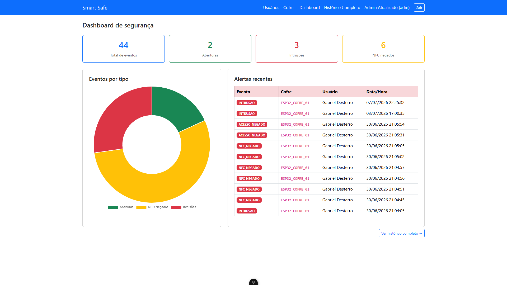
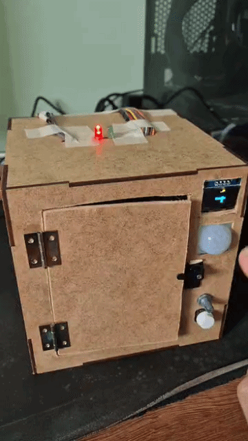

# 🔒 Smart Safe - Sistema de Segurança IoT

Um sistema integrado de hardware (IoT) e software (Web) que simula um cofre inteligente com duas etapas de verificação e monitoramento em tempo real. 

Este projeto foi desenvolvido para consolidar conhecimentos em **Desenvolvimento Back-end**, **Internet das Coisas (IoT)** e **Interfaces Reativas**, unindo o mundo físico ao digital.

---

## 📸 Demonstração do Projeto

*(As imagens abaixo ilustram a interface de gerenciamento e o protótipo físico construído).*

### Dashboard de Administração (Vue.js)

> *Painel de controle para monitoramento em tempo real e gestão de permissões.*

### Protótipo Físico (IoT / ESP32)

> *Hardware construído utilizando ESP32, sensores e atuadores para o controle físico da trava.*

---

## 🚀 Tecnologias e Arquitetura de Rede

A arquitetura do projeto foi desenhada para garantir comunicação rápida, segura e bidirecional entre o dispositivo local (Edge) e o servidor Back-end.

**Dispositivo e Conectividade (Edge/Device IoT):**
* **Microcontrolador:** ESP32.
* **Conectividade:** Wi-Fi / 802.11 operando em modos simultâneos:
  * **Modo STA:** Para conectar o cofre à rede local existente.
  * **Modo AP:** Criando uma rede própria do cofre para configurações.
* **Web Embarcada:** Interface local no próprio ESP32 via HTTP.
* **Sincronização de Tempo:** Utilização do protocolo NTP para controle preciso de data/hora.

**Mensageria e Comunicação (ESP32 ↔ Node.js):**
O sistema utiliza uma abordagem híbrida de comunicação para otimizar o fluxo de dados:
* **ESP32 ➔ Node.js (MQTT):** Os eventos físicos e a telemetria do cofre são enviados via protocolo MQTT. As mensagens são estruturadas no formato JSON e intermediadas pelo broker HiveMQ, garantindo baixa latência para os registros de atividades.
* **Node.js ➔ ESP32 (HTTP):** O Back-end se comunica com a API embarcada no hardware via HTTP/REST, enviando comandos e respostas como, por exemplo, a validação de acesso via NFC.

**Back-end & Front-end:**
* **API / Servidor:** Node.js validando regras de negócio e persistindo dados (SQLite).
* **Interface:** Vue.js com HTML5/CSS3/JavaScript.

---

## ⚙️ Funcionamento do Fluxo de Dados

1. O **ESP32** monitora as entradas físicas (ex: leitura de tag NFC, sensores de porta).
2. Ao detectar um evento, o hardware encapsula os dados em **JSON** e publica em um tópico **MQTT** via HiveMQ.
3. O **Node.js** assina esse tópico, recebe o evento instantaneamente, processa a regra de negócio (ex: verificar se a tag NFC tem permissão) e salva o log no banco de dados.
4. Para enviar a resposta ou liberar a trava, o Node.js dispara uma requisição **HTTP** direto para a API embarcada do ESP32.
5. Em paralelo, o Dashboard em **Vue.js** consome as informações atualizadas do Node.js, exibindo tudo para o administrador em tempo real.

---

## 👨‍💻 Autor

**Gabriel Desterro**
*Desenvolvedor Back-end | Node.js | Transição de Carreira (Engenharia)*
* [LinkedIn](https://www.linkedin.com/in/gabriel-desterro-b447861a1)